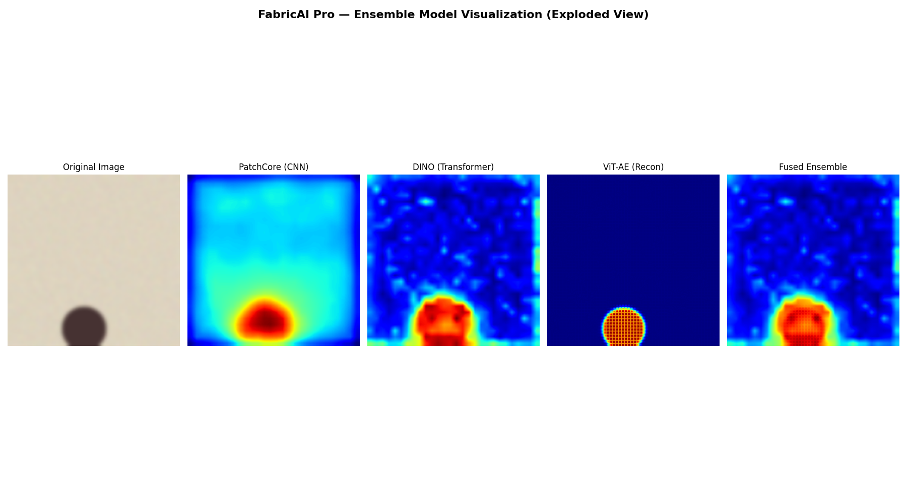

# UltraFabric-Vision: Real-Time Universal Cloth Defect Detection



UltraFabric-Vision is an industrial-grade, AI-powered computer vision suite engineered for high-fidelity, real-time cloth defect detection. Developed as an interdisciplinary project (RV College of Engineering), this platform leverages state-of-the-art transformer architectures to identify surface anomalies, weaving defects, and structural irregularities in textiles at high throughput.


## 🧠 Core Neural Architecture

The core inference engine is built on an **Ensemble Fusion** approach combining deep feature extraction with local anomaly scoring:

1. **DINO-v2 Backbone (Self-Supervised Vision Transformer)**
   - Utilizes `ViT-S/8` pretrained without human supervision.
   - Extracts robust, high-dimensional semantic patch embeddings (dim=384/768) that inherently understand structural textures.
   - **Multi-Head Attention Extraction:** The system hooks into the final attention layer to explicitly extract the actual `(6, 28, 28)` attention maps, showing exactly which regions of the fabric the transformer focuses on.

2. **PatchCore Memory Bank Alignment**
   - Applies the PatchCore anomaly detection paradigm (K-Nearest Neighbor density estimation) to the extracted DINO-v2 features.
   - A Coreset sub-sampling algorithm condenses the memory bank of "normal" fabric patches, enabling real-time distance computations (Mahalanobis scoring).

3. **ViT Autoencoder (Reconstruction)**
   - A supplementary Vision Transformer Autoencoder reconstructs the input tensor. High reconstruction error (`MSE`) serves as a secondary proxy for identifying anomalous regions not captured by the memory bank.

4. **Ensemble Fusion Latent Map**
   - The final spatial anomaly heat map is generated by projecting the KNN distance scores back to the input spatial dimensions (`14x14` upscaled via cubic interpolation) and combining them with the ViT autoencoder residuals.

## 🚀 System Components

- **`backend_api.py` (FastAPI + PyTorch)**: An asynchronous REST and WebSocket API. It processes video streams and batch images on GPU, extracting multi-head telemetry and anomaly gradients in real-time.
- **`models/` (AI Engine)**: Contains the PyTorch definitions for the DINO Feature Extractor, PatchCore memory algorithms, and ViT Autoencoders.
- **`web_app/` (React + Vite)**: A high-performance, dark-mode laboratory dashboard. It renders the raw video feed alongside a synchronized, low-latency 6-head Transformer Activation Trace grid.
- **`remote_cam/` (Firebase WebRTC/Streamer)**: An ultra-low latency WebRTC streaming client designed for remote edge devices.

## 🛠️ Installation & Setup

1. **Python Environment (Backend)**
   ```bash
   python3 -m venv venv
   source venv/bin/activate
   pip install -r requirements.txt
   ```
   *Note: Ensure PyTorch is compiled with CUDA support for real-time inference.*

2. **React Dashboard (Frontend)**
   ```bash
   cd web_app
   npm install
   ```

3. **Weights & Memory Banks**
   Ensure the following compiled weights exist in the `weights/` directory:
   - `dino_memory_bank.pkl`
   - `patchcore_memory_bank.pkl`
   - `vit_ae_weights.pth`

## 🚦 Execution

Run the complete suite (Backend + Frontend) via the provided automation script:
```bash
./start_web.sh
```
This automatically initializes the PyTorch GPU models via FastAPI on `http://localhost:8000` and serves the React dashboard on `http://localhost:5179`.

## 📡 Live Telemetry & Visualization

The frontend explicitly visualizes the internal state of the neural networks:
- **HEAD 1-6:** Individual DINO-v2 transformer attention heads (tracking specific texture frequencies).
- **ENSEMBLE FUSION:** A composite spatial gradient showing exactly where structural defects exist on the material.

---
**RV College of Engineering - Interdisciplinary Project (EC367P)**
*Contributors: Varshini C B, Navi Deepak Gurupad, Ayush, Sanjana T M*
