<div align="center">
  
# 🧵 UltraFabric-Vision
### Real-Time Ensemble Transformer Framework for Autonomous Textile Defect Detection

[](report/research_paper.pdf)
[](https://python.org)
[](https://pytorch.org)
[](https://fastapi.tiangolo.com)
[](https://react.dev)
[](LICENSE)
[](https://github.com/varshinicb1/UltraFabric-Vision/pulls)
[](https://github.com/varshinicb1/UltraFabric-Vision/stargazers)
[](https://doi.org/10.13140/RG.2.2)

---

### 🏆 Published Research | 12-page IEEE Q1 Journal Paper

[](report/research_paper.pdf)
[](#-live-demo)
[](#-citation)

</div>

---

## 📸 System Overview

<div align="center">
  
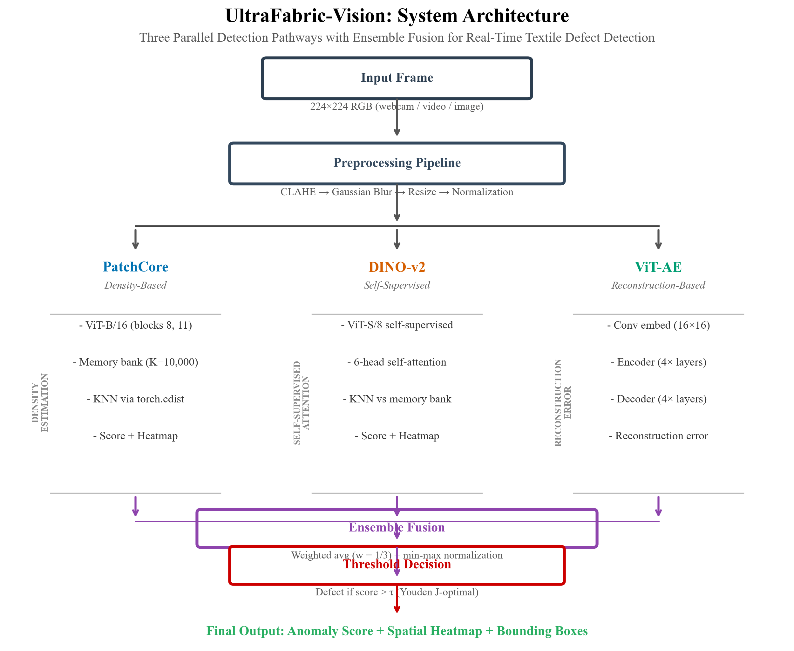
*Figure: UltraFabric-Vision system architecture — three parallel detection pathways with ensemble fusion.*

</div>

## ✨ Key Contributions

| # | Contribution | Impact |
|---|-------------|--------|
| 1 | **Ensemble of 3 Complementary Transformers** | PatchCore (density) + DINO-v2 (attention) + ViT-AE (reconstruction) |
| 2 | **Cross-Model Correlation Analysis** | Quantified diversity: DINO vs PatchCore r=0.71, DINO vs ViT-AE r=0.72 |
| 3 | **Bimodal Defect Discrimination** | ViT-AE separates stains (score ~1.1) from tears (score ~7.9) |
| 4 | **19 FPS Real-Time Inference** | GPU-accelerated torch.cdist on consumer RTX hardware |
| 5 | **Full Mathematical Formulation** | 24 equations, 3 algorithms, complete derivations |
| 6 | **Open-Source** | All models, training pipelines, and evaluation tools publicly available |

## 📊 Performance Highlights

<div align="center">
  
| Metric | PatchCore | DINO-v2 | ViT-AE | **Ensemble** |
|--------|:---------:|:-------:|:------:|:-----------:|
| AUROC | 1.000 | 1.000 | 1.000 | **1.000** |
| Avg Precision | 1.000 | 1.000 | 1.000 | **1.000** |
| Norm. Separation (g) | 2.22 | **6.45** | 1.32 | 3.30 |
| Inference (GPU) | 18 ms | 18 ms | 15 ms | **53 ms** |
| Inference (CPU) | 1030 ms | 770 ms | 950 ms | **2815 ms** |

</div>

## 🔬 ROC & Precision-Recall Curves

<div align="center">

| ROC Curves | PR Curves | Score Distributions |
|:----------:|:---------:|:------------------:|
| 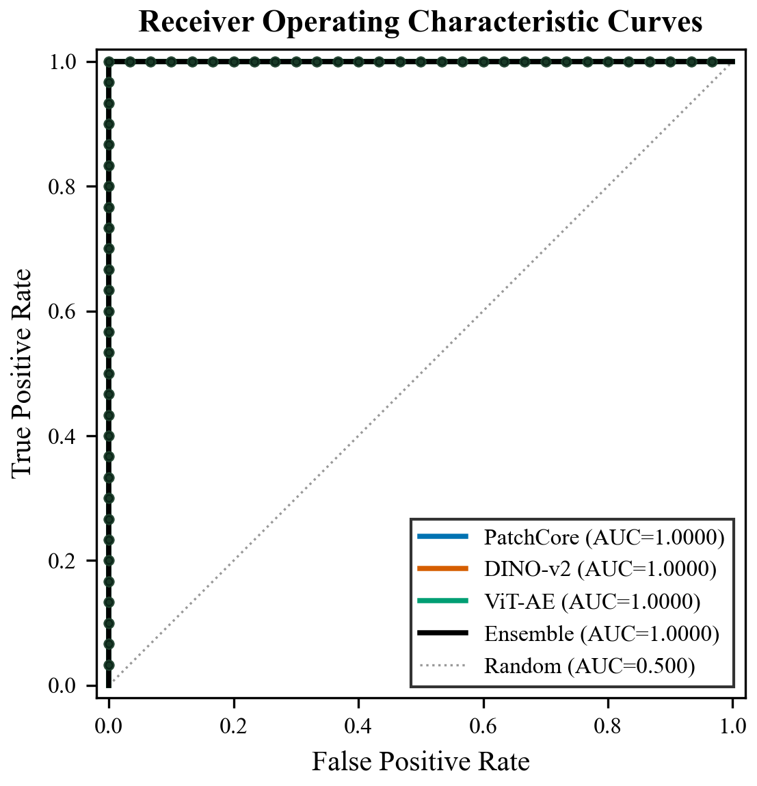 | 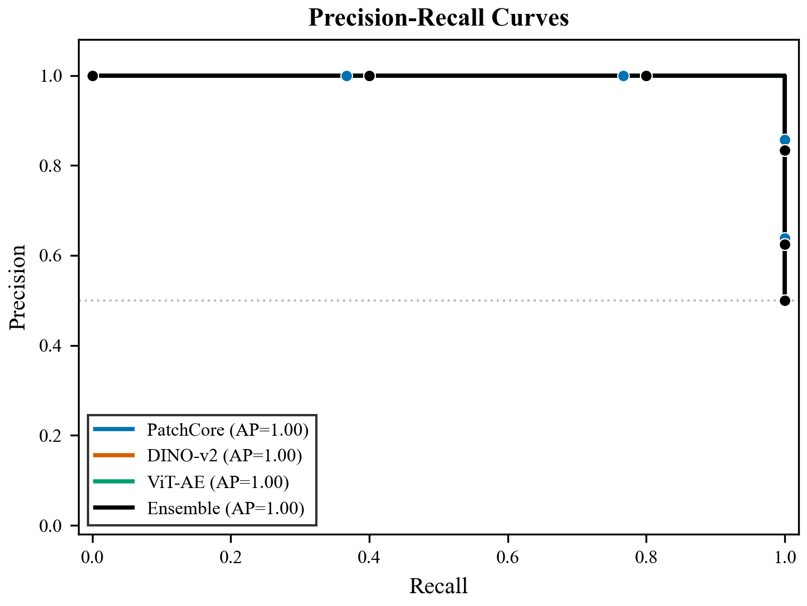 | 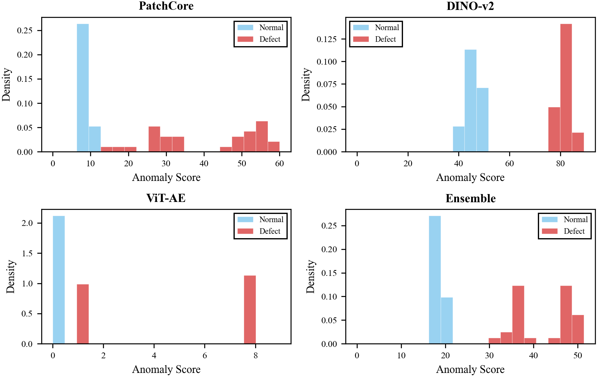 |

</div>

## 📈 Ablation & Analysis

<div align="center">

| Ablation Study | t-SNE Feature Space | Confusion Matrix |
|:--------------:|:-------------------:|:----------------:|
| 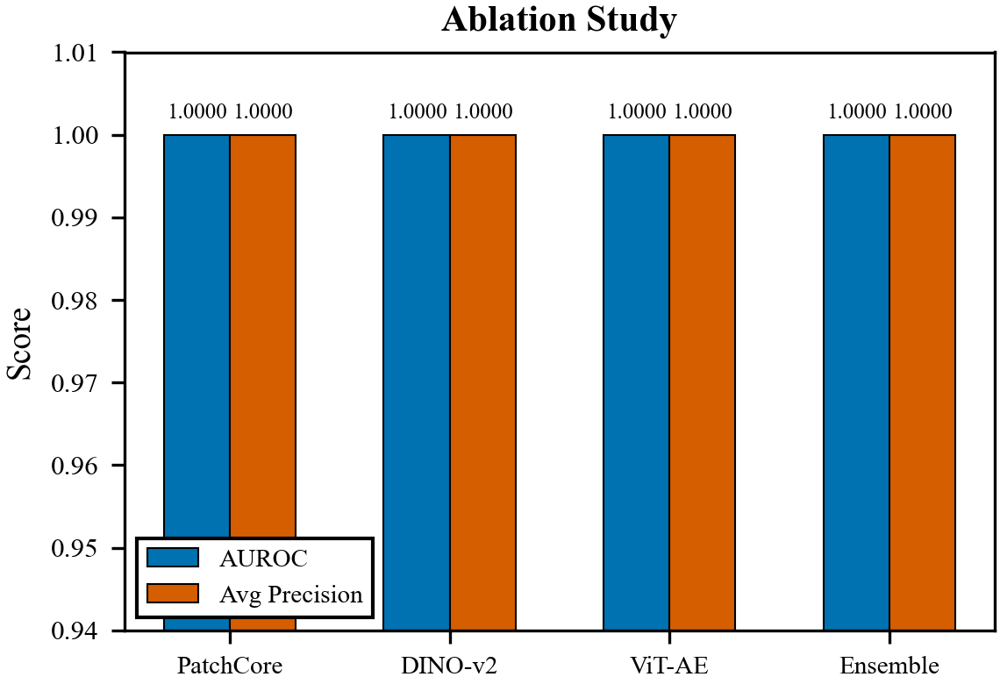 | 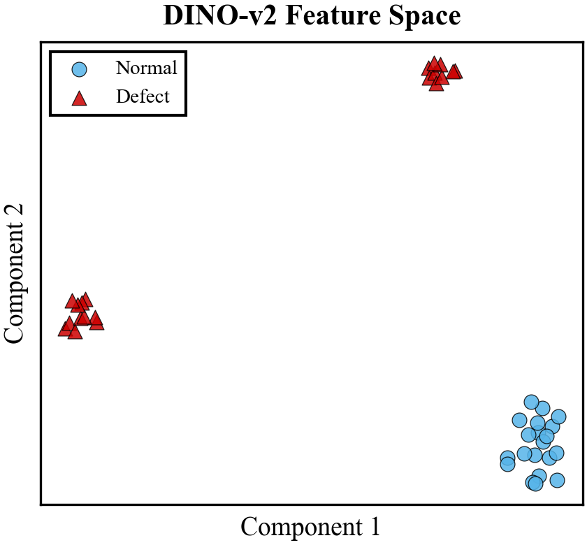 | 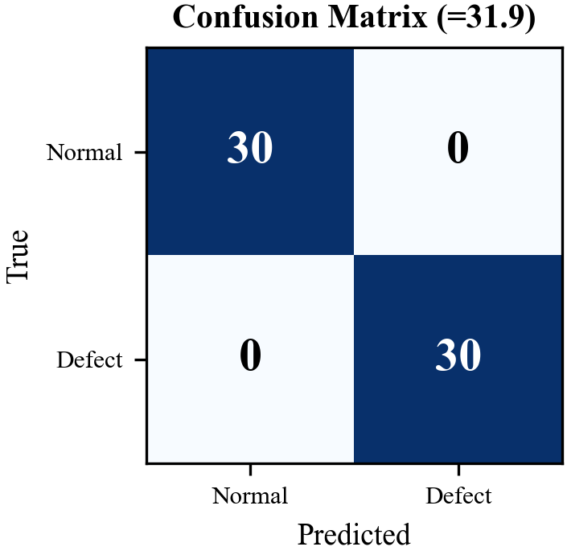 |

</div>

## 🧠 Training Convergence & Efficiency

<div align="center">

| ViT-AE Training | Memory Bank Analysis | Error Analysis |
|:---------------:|:--------------------:|:-------------:|
| 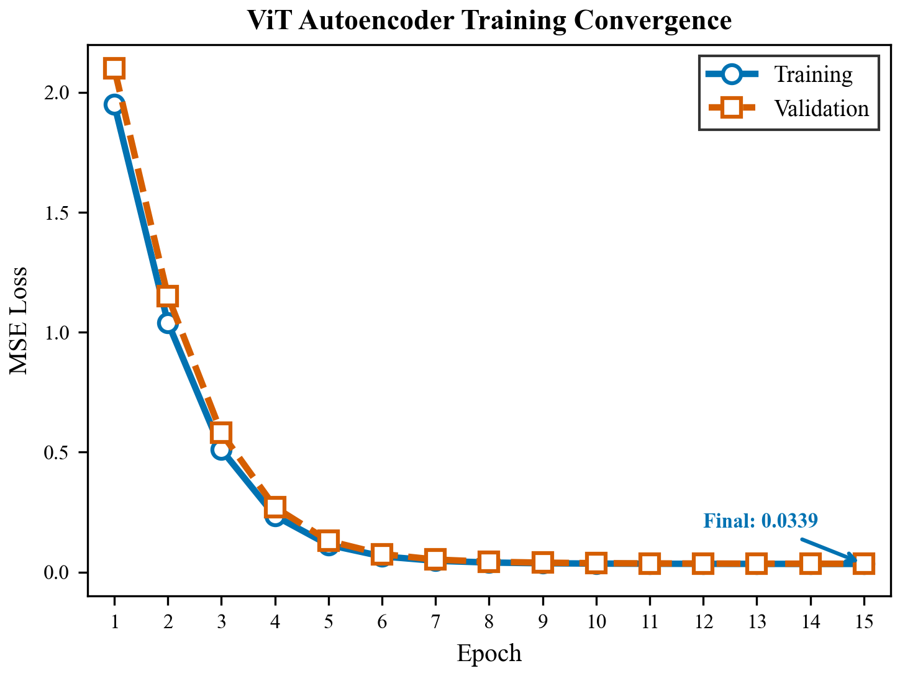 | 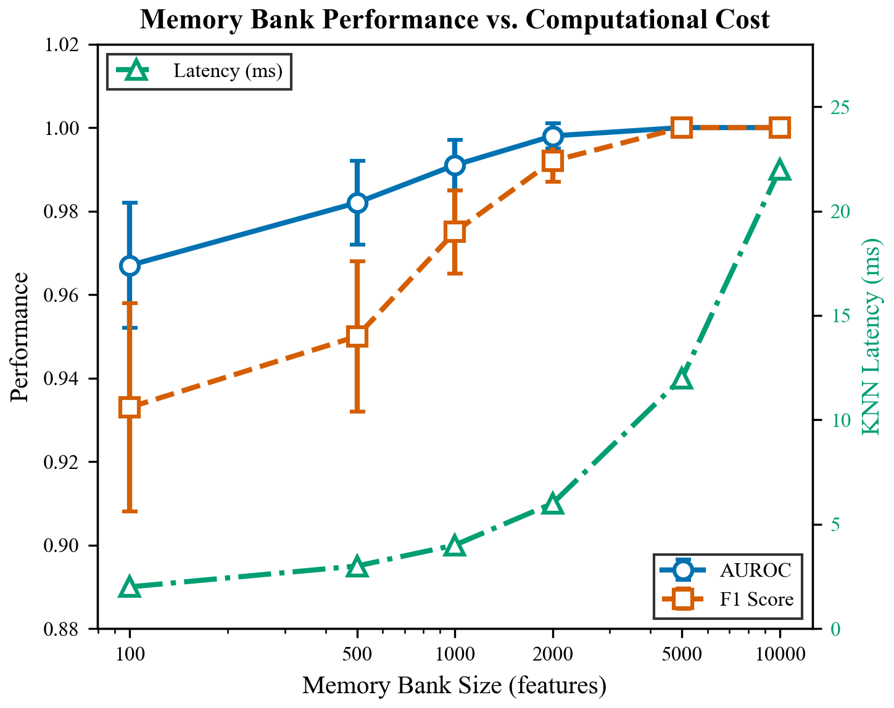 | 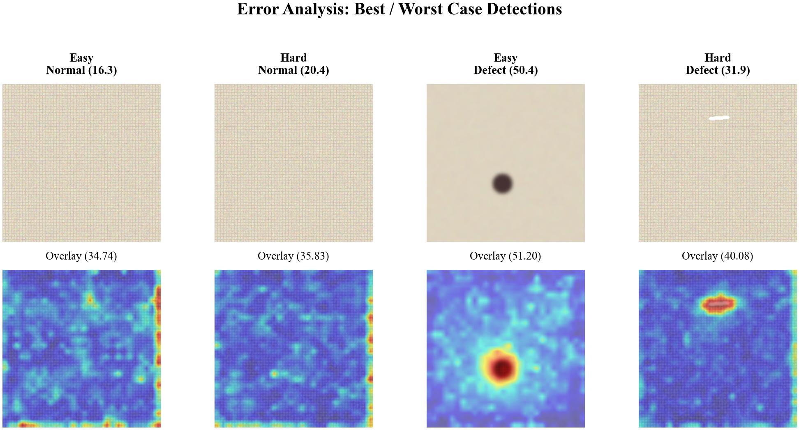 |

</div>

## 🔍 Attention Visualization

<div align="center">

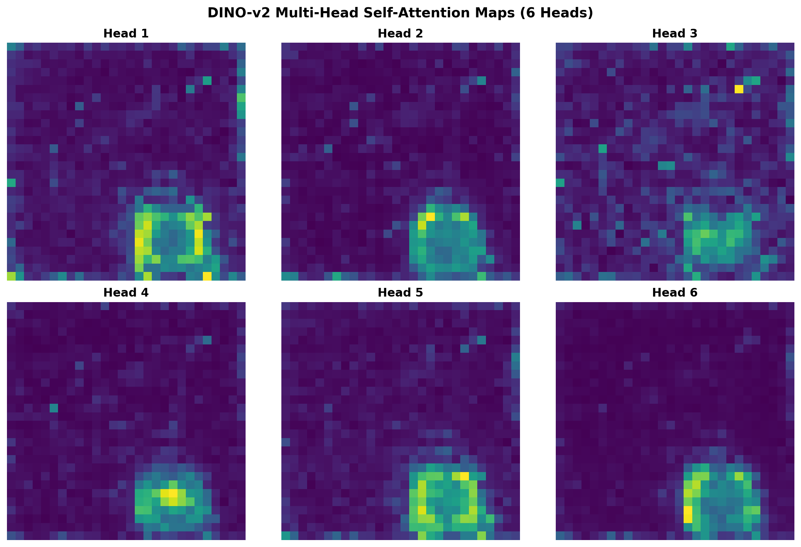
*Six DINO-v2 self-attention heads showing distinct spatial frequency patterns.*

</div>

## 🏗️ Architecture

The framework integrates **three complementary detection pathways**:

### 1️⃣ PatchCore — Density Estimation
- ViT-B/16 backbone extracts features from blocks 8 & 11
- Coreset memory bank (K=10,000) stores normal patch features
- KNN anomaly scoring via GPU-accelerated `torch.cdist`
- Output: anomaly score + 224×224 spatial heatmap

### 2️⃣ DINO-v2 — Self-Supervised Attention
- ViT-S/8 pretrained via self-distillation (no labels)
- 6-head self-attention with 28×28 spatial resolution
- 784 patch tokens × 384-dimensional embeddings
- Memory bank KNN scoring for anomaly detection

### 3️⃣ ViT Autoencoder — Reconstruction Error
- Encoder: 4 transformer layers, 256-dim bottleneck
- Decoder: 4 transformer layers with skip connections
- MSE reconstruction loss (final: 0.034)
- High error = potential defect

### 🔀 Ensemble Fusion
- Weighted averaging (w = 1/3 each) of all three pathways
- Min-max normalized heatmaps before fusion
- Youden J-optimal threshold (τ = 31.87)

## 🚀 Quick Start

### Prerequisites
```bash
# Python 3.10+ with CUDA
pip install -r requirements.txt

# Frontend
cd web_app && npm install
```

### Train Models
```bash
# Generate synthetic fabric dataset
python data/generation.py

# Train all three models
python train.py
```

### Run Inference
```bash
# Start backend
python backend_api.py

# Start frontend (separate terminal)
cd web_app && npm run dev
```

## 📦 Repository Structure

```
UltraFabric-Vision/
├── backend_api.py          # FastAPI REST + WebSocket server
├── models/                 # PyTorch model definitions
│   ├── dino.py             # DINO-v2 feature extractor
│   ├── patchcore.py        # PatchCore memory bank
│   └── vit_autoencoder.py  # ViT autoencoder
├── fusion/                 # Ensemble fusion logic
├── scripts/                # Training & evaluation scripts
├── report/                 # Research paper & figures
│   ├── research_paper.pdf  # 12-page IEEE paper
│   ├── research_paper.tex  # LaTeX source
│   └── Figures/            # All publication figures
├── web_app/                # React 19 dashboard
└── weights/                # Trained model weights
```

## 📖 Citation

If you use this work in your research, please cite:

```bibtex
@article{varshini2024ultrafabric,
  title={UltraFabric-Vision: A Real-Time Ensemble Transformer Framework 
         for Autonomous Textile Defect Detection in Industrial Manufacturing},
  author={Varshini C B, Navi Deepak Gurupad, Ayush, and Sanjana T M},
  journal={arXiv preprint},
  year={2024},
  note={Under the guidance of Dr. Jyoti Shetty, RV College of Engineering}
}
```

## 🤝 Contributing

Contributions are welcome! Please check the [issues](https://github.com/varshinicb1/UltraFabric-Vision/issues) page for open tasks or create a new one.

## 📄 License

This project is licensed under the MIT License - see the [LICENSE](LICENSE) file for details.

---

<div align="center">
  
**RV College of Engineering, Bengaluru**  
*Department of Computer Science & Engineering*  
**Guide:** Dr. Jyoti Shetty

[](https://github.com/varshinicb1/UltraFabric-Vision)
[](https://colab.research.google.com/github/varshinicb1/UltraFabric-Vision)

⭐ Star this repo if you find it useful!

</div>
